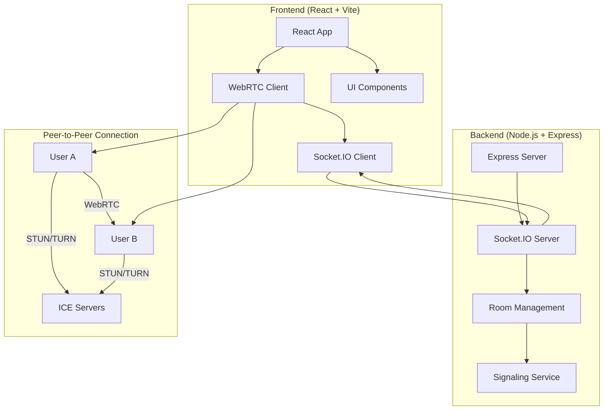
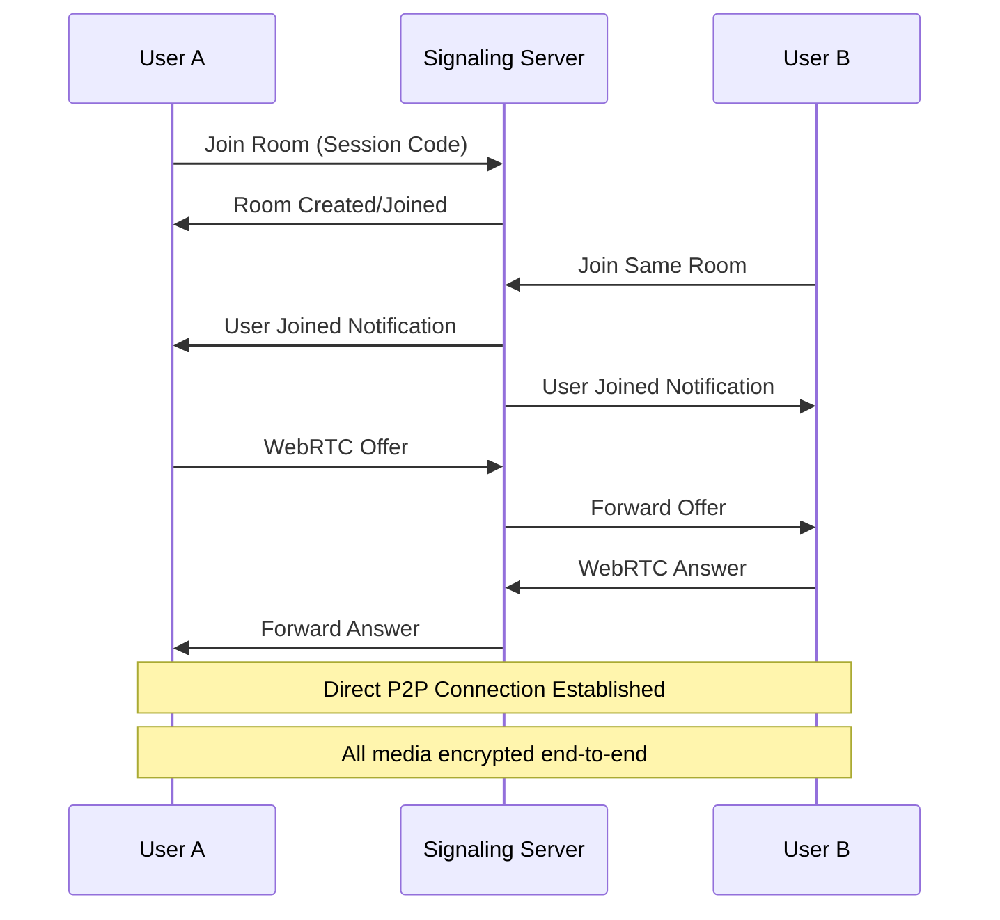
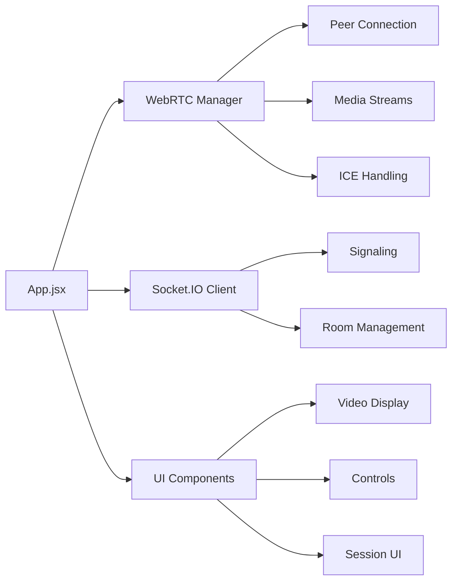
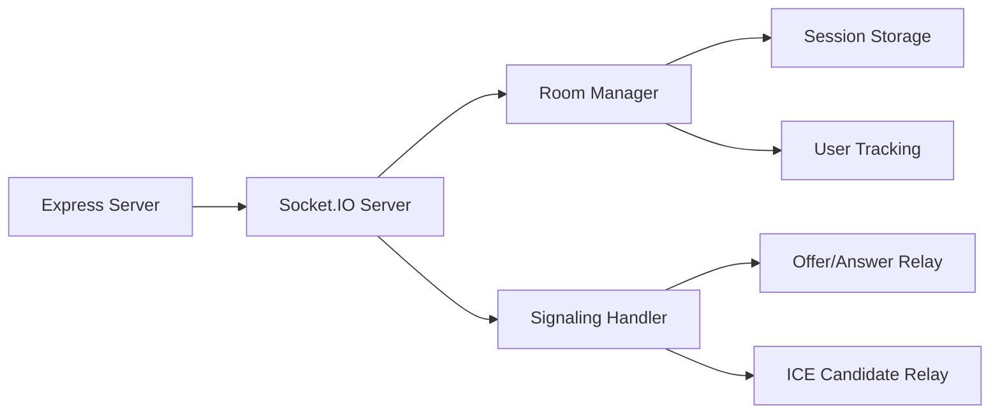

# 🎥 VokChat - Secure Peer-to-Peer Video Calling

<div align="center">


**Connect. Share. Heal.**  
*Your Thoughts, Fully Protected. End-to-End Encrypted.*

[](https://reactjs.org/)
[](https://socket.io/)
[](https://webrtc.org/)
[](https://tailwindcss.com/)
[](https://vitejs.dev/)

</div>

---

## 🌟 About VokChat

VokChat is a modern, secure video calling platform designed for confidential conversations. Built with privacy-first principles, it enables direct peer-to-peer connections with end-to-end encryption, ensuring your conversations remain private and secure.

### 🎯 Mission
To provide a safe, supportive, and empowering space for meaningful conversations through cutting-edge technology and thoughtful design.

### 🛡️ Core Values
- **Confidential** - Your conversations stay private
- **Supportive** - Designed for meaningful connections  
- **Empowering** - Technology that serves human connection

---

## 🏗️ Technical Architecture

### System Overview



### Technology Stack

#### Frontend
- **React 19.1.0** - Modern UI framework with hooks
- **Vite 7.0.4** - Lightning-fast build tool
- **Tailwind CSS 4.1.11** - Utility-first CSS framework
- **Socket.IO Client 4.8.1** - Real-time communication
- **React Icons 5.5.0** - Beautiful icon library

#### Backend
- **Node.js** - Server runtime
- **Express 5.1.0** - Web framework
- **Socket.IO 4.8.1** - Real-time bidirectional communication
- **CORS** - Cross-origin resource sharing

#### Core Technologies
- **WebRTC** - Peer-to-peer video/audio streaming
- **STUN/TURN Servers** - NAT traversal and relay
- **ICE Protocol** - Connection establishment

---

## 🔐 Security & Privacy Features

### End-to-End Encryption
- **Direct P2P Connection** - No server involvement in media streams
- **WebRTC Encryption** - Built-in SRTP/SRTCP encryption
- **Session Isolation** - Unique room codes for each session

### Privacy Protection
- **No Account Required** - Anonymous usage
- **No Data Storage** - Conversations aren't stored
- **Session-Based** - Temporary connections only

### Security Measures


---

## 🚀 Features

### Core Functionality
- ✅ **One-to-One Video Calls** - High-quality peer-to-peer video
- ✅ **Audio Support** - Crystal clear voice communication
- ✅ **Session Management** - Unique 6-character session codes
- ✅ **Real-time Controls** - Mute, pause video, end call
- ✅ **Responsive Design** - Works on desktop and mobile

### User Experience
- 🎨 **Modern UI** - Clean, minimalist design
- 📱 **Mobile Optimized** - Touch-friendly controls
- ⚡ **Instant Connection** - Quick session setup
- 🔄 **Auto-reconnection** - Handles network issues gracefully

### Technical Features
- 🌐 **WebRTC** - Standard web technology
- 📡 **STUN Servers** - NAT traversal support
- 🔒 **Encrypted Media** - SRTP/SRTCP protection
- 🎯 **Low Latency** - Direct peer connections

---

## 📦 Installation & Setup

### Prerequisites
- Node.js 18+ 
- npm or yarn

### Quick Start

1. **Clone the repository**
```bash
git clone https://github.com/yourusername/vokchat.git
cd vokchat
```

2. **Install frontend dependencies**
```bash
npm install
```

3. **Install backend dependencies**
```bash
cd backend
npm install
cd ..
```

4. **Set up environment variables**
```bash
# Create .env file in backend directory
echo "PORT=5001" > backend/.env
```

5. **Start the development servers**

**Terminal 1 - Backend:**
```bash
cd backend
npm start
```

**Terminal 2 - Frontend:**
```bash
npm run dev
```

6. **Open your browser**
Navigate to `http://localhost:5173`

---

## 🎮 Usage Guide

### Starting a Call
1. Click **"Start a Call"** button
2. Share the generated session code with your contact
3. Wait for them to join

### Joining a Call
1. Enter the session code provided by the host
2. Click **"Join Call"** button
3. Grant camera/microphone permissions

### During the Call
- 🎤 **Mute/Unmute** - Click microphone icon
- 📹 **Pause/Resume Video** - Click video icon  
- 📞 **End Call** - Click red phone icon
- 📋 **Copy Session Code** - Click copy icon next to code

---

## 🏛️ Project Structure

```
VokChat/
├── 📁 src/                    # Frontend source code
│   ├── App.jsx               # Main application component
│   ├── main.jsx              # React entry point
│   └── index.css             # Global styles & fonts
├── 📁 backend/               # Backend server
│   ├── index.js              # Express + Socket.IO server
│   └── package.json          # Backend dependencies
├── 📁 public/                # Static assets
│   └── 📁 fonts/            # Custom typography
├── package.json              # Frontend dependencies
├── tailwind.config.js        # Tailwind configuration
└── vite.config.js           # Vite build configuration
```

---

## 🔧 Development

### Available Scripts

**Frontend:**
```bash
npm run dev      # Start development server
npm run build    # Build for production
npm run preview  # Preview production build
npm run lint     # Run ESLint
```

**Backend:**
```bash
cd backend
npm start        # Start production server
```

### Key Components

#### Frontend Architecture


#### Backend Architecture


---

## 🌐 Deployment

### Frontend (Vercel/Netlify)
```bash
npm run build
# Deploy dist/ folder
```

### Backend (Railway/Render)
```bash
# Set environment variables
PORT=5001
NODE_ENV=production

# Deploy backend/ folder
```

### Environment Variables
```env
# Backend (.env)
PORT=5001
NODE_ENV=production
```

---

## 🤝 Contributing

We welcome contributions! Please see our [Contributing Guidelines](CONTRIBUTING.md) for details.

### Development Setup
1. Fork the repository
2. Create a feature branch
3. Make your changes
4. Add tests if applicable
5. Submit a pull request

---

## 📄 License

This project is licensed under the ISC License - see the [LICENSE](LICENSE) file for details.

---

## 🙏 Acknowledgments

- **WebRTC** - For peer-to-peer communication
- **Socket.IO** - For real-time signaling
- **React Team** - For the amazing framework
- **Tailwind CSS** - For the utility-first CSS
- **Vite** - For the lightning-fast build tool

---

<div align="center">

**Made with ❤️ for secure, meaningful connections**

[](https://github.com/yourusername/vokchat)
[](https://github.com/yourusername/vokchat)
[](https://github.com/yourusername/vokchat/issues)

</div>
